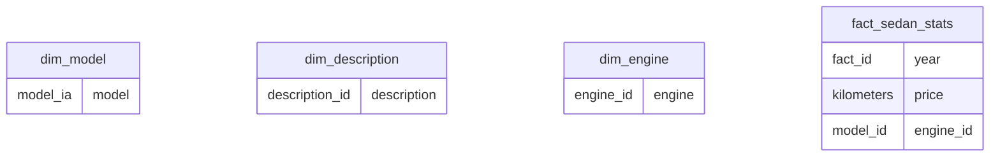

# Encuentra 24 ETL

ETL process for Encuentra24 El Salvador with `Selenium` to extract data about car announcements and after be transformed
with `Pandas`.

Project is separated in three. A notebook for extraction with Selenium which use a `xpath.yml` file
where are defined the `xpath` sentences to use to extract required data to create the dataframes. Another with the
transformations to apply to the data extracted.
And the last one with the functions required to create entities like a star model for a Warehouse.

> `persistence` directory has the outputs from `Extraction` and `Loading` notebooks.

## Extraction :brain:

Notebook is structured by sections. Here data are extracted from `Encuentra24.com`.

* Includes init instructions (dependencies, global configurations)
* Functions section, where are defined all functions used.
* Relevant cell has its respective text to explain what is happening.

> Just execute the notebook to extract data from `Encuentra24.com` and save it in `persistence` directory.

## Transformation :moon:

Notebook is structured by sections. Here data are checked and fixed in case oƒ inconsistencies.

* Functions section, where are defined all functions used.
* Transformations required are explained, with a subtitle and description to explain what was the transformation
  applied.

> This notebook is not required to run, just execute it if you data extracted from `Extraction` notebook has some of the
> problems described in the notebook.

## Load :chart:

Notebook is structured by sections. Here data are split to follow a star model.

---
:bamboo: ~